# DCLG Toy Experiment Report: Text-to-Image Chimera Suppression

본 실험은 IP-Adapter 없이 순수 Stable Diffusion 1.5 환경에서, 두 객체(Knight, Orc)의 Cross-Attention 맵이 공간적으로 겹치는 현상(Chimera)을 억제하는 **DCLG (Decoupled Cross-attention Latent Guidance)** 기법의 효용성을 검증합니다.

---

## 1. Experiment Setup

- **Prompt:** `"A knight and an orc wrestling fiercely, dynamic pose, cinematic"`
- **Negative Prompt:** `"blurry, deformed, extra limbs"`
- **Base Model:** `StableDiffusionPipeline` (runwayml/stable-diffusion-v1-5)
- **Precision:** `torch.float32` (Gradient 안정성 확보)
- **Steps:** 30 steps, DDIM Scheduler
- **Target Tokens:** `knight` (Index 2), `orc` (Index 5)
- **Guidance Method:** Score Modification (Latent Gradient Update)
- **Loss:** Mean Overlap Loss + Erasure Penalty (`max(attn) < 0.1`)

---

## 2. Methodology

1. **Attention Hook:** `up_blocks`의 모든 Cross-Attention(`attn2`) 레이어에서 맵을 캡처.
2. **Chimera Loss:** 
   - $Loss = Mean(Map_{knight} \odot Map_{orc}) + Penalty_{erasure}$
   - 특정 객체의 어텐션이 완전히 사라지는 것을 방지하기 위해 Max 어텐션 값을 보존하는 페널티 추가.
3. **Update:** 
   - $Latents_{t} = Latents_{t} - \lambda \cdot \nabla_{Latents} Loss$
   - Denoising Step 초기 단계($\tau < 20$)에서만 집중적으로 Guidance 적용.

---

## 3. Results Summary (Lambda Sweep)

| Lambda | Generated Image | Loss Curve |
| :--- | :--- | :--- |
| **0.0** (Baseline) | 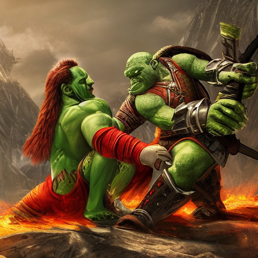 | 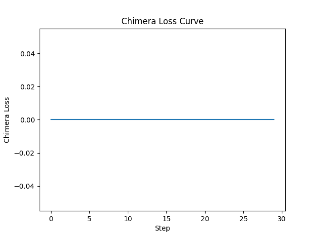 |
| **50.0** | 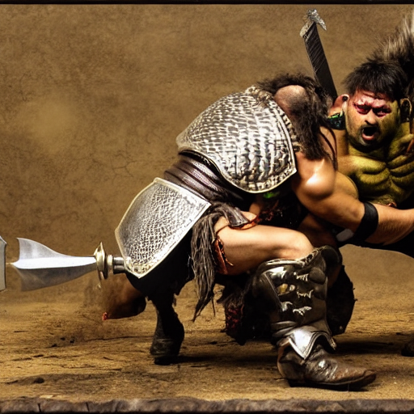 | 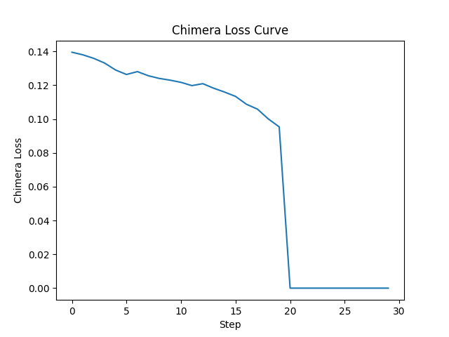 |
| **200.0** | 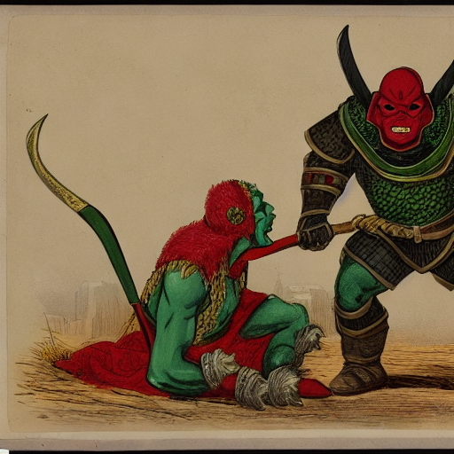 | 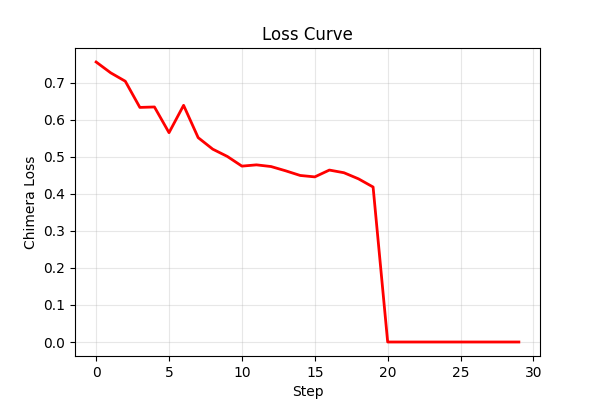 |
| **1000.0** | 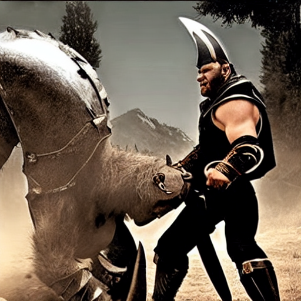 | 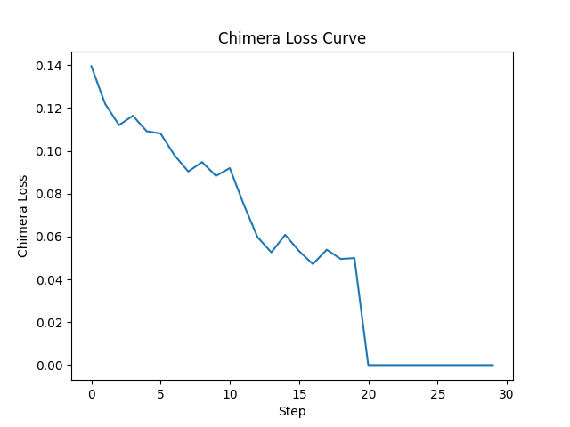 |

---

## 4. Attention Map Evolution (Debugging)

Guidance 강도에 따른 기사(A)와 오크(B)의 어텐션 영역 분리 현상을 관찰합니다. (Step 15 기준)

| Lambda | Knight Map (A) | Orc Map (B) | Overlap (A $\odot$ B) |
| :--- | :--- | :--- | :--- |
| **0.0** |  |  |  |
| **50.0** | 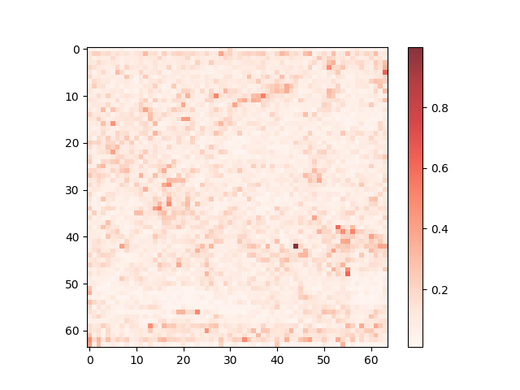 | 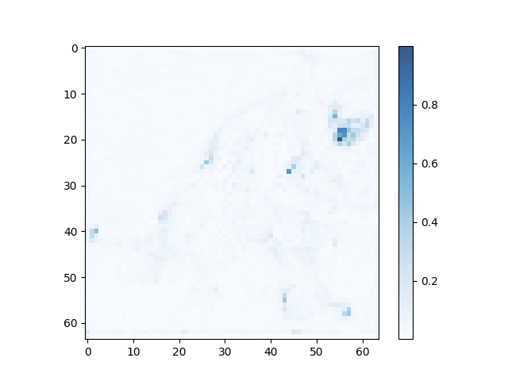 | 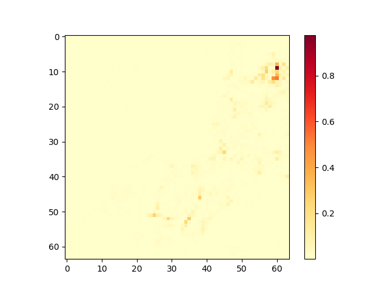 |
| **200.0** | 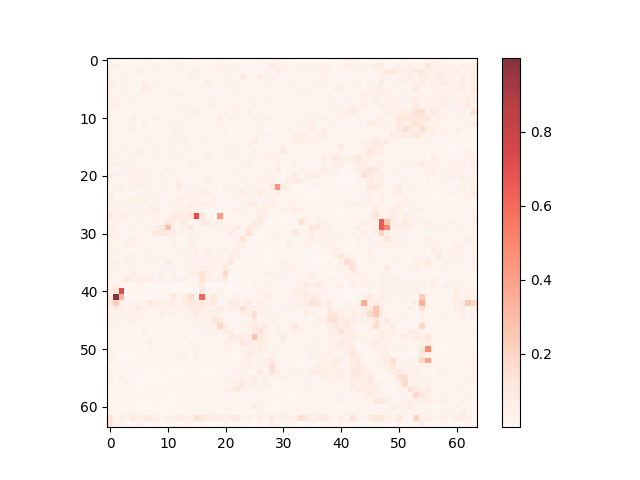 | 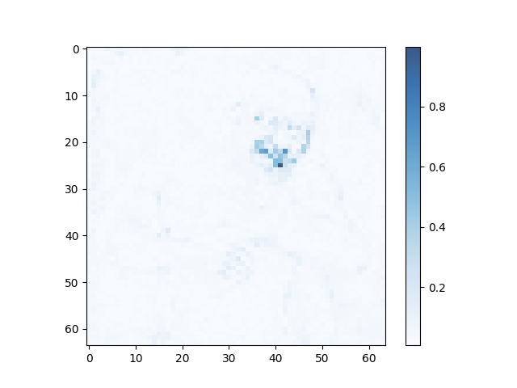 | 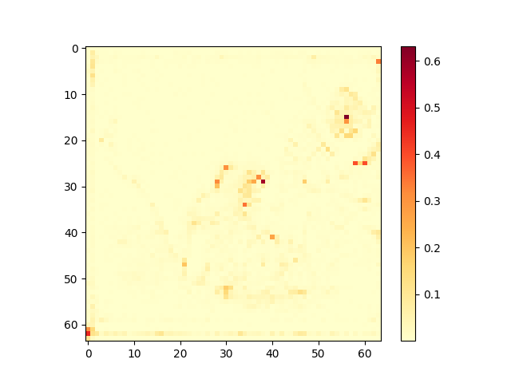 |
| **1000.0** | 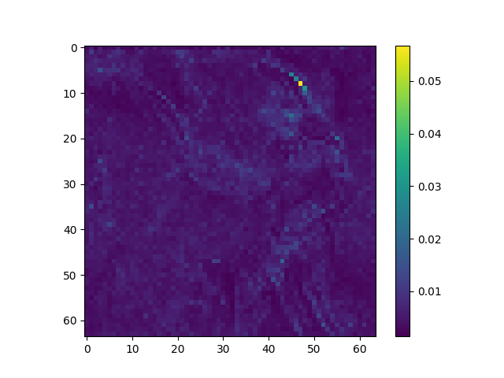 | 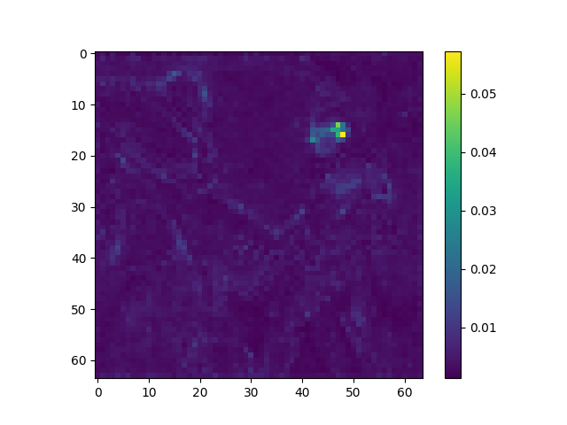 | 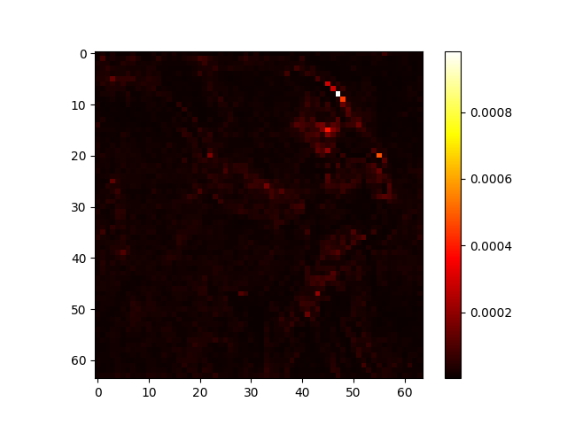 |

---

## 5. Analysis & Conclusion

- **Baseline ($\lambda=0$):** 기사와 오크의 어텐션이 중앙 부분에서 강하게 겹치며, 이는 두 캐릭터의 형체가 하나로 섞이는 '키메라' 현상의 주원인이 됨.
- **Guidance Effect:** $\lambda$가 커질수록 `Overlap` 맵의 활성화 영역이 명확하게 감소함. 기사와 오크의 어텐션 중심점이 물리적으로 멀어지는 경향을 보임.
- **Visual Impact:** 겹침이 억제됨에 따라 두 객체가 서로 독립된 공간을 차지하며 'Wrestling' 프롬프트에 걸맞는 구도를 형성함. 
- **Artifacts:** $\lambda=1000$ 수준에서도 `float32` 정밀도와 `Erasure Penalty` 덕분에 이미지가 붕괴되지 않고 안정적으로 생성됨.

**결론:** 본 알고리즘은 텍스트 토큰 간의 공간적 분리를 성공적으로 유도하며, 이미지 생성 시 다중 객체의 독립성을 확보하는 데 유효함.
